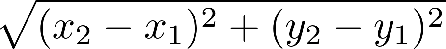

**Due**: Friday, June 2nd by 11:59 PM

Acknowledgment: The idea for this assignment comes from [Tom Ellman](http://pages.vassar.edu/tomellman/) at Vassar College.

CS 201 - Assignment 2
=====================

Getting Started
---------------

Downlaod [CS201\_Assign02.zip](CS201_Assign02.zip). Import it into your Eclipse workspace (**File&rarr;Import&rarr;General&rarr;Existing Projects into Workspace&rarr;Archive File**.)

You should see a project called **CS201\_Assign02** in the Package Explorer.

Your Task
---------

Your task is to complete the implementation of the **Disk** class. (In the next assignment, you will use your **Disk** class to implement a game that will use this class.)

An instance of the **Disk** class represents one of the disks placed on the game board. Each **Disk** object should store the **x** and **y** coordinates of the disk's center, a **radius**, and a color (represented as member of the **DiskColor** enumeration). You should add fields to the class for each of these 4 properties.

You must implement 7 methods:

-   A constructor which initializes the fields of a newly-created **Disk** object using values specified by parameter values
-   A **getX** method which returns the **Disk** object's center x coordinate value
-   A **getY** method which returns the **Disk** object's center y coordinate value
-   A **getRadius** which returns the **Disk** object's radius value
-   A **getColor** method which returns the **Disk** object's color
-   An **overlaps** method which determines whether or not the **Disk** object overlaps another **Disk** object passed as a parameter
-   An **isOutOfBounds** method which determines whether or not the **Disk** object partly or completely lies outside the bounds of the rectangular game board

Each method is described by a comment which explains, in detail, how the method should work.

A JUnit test class called **DiskTest** is provided. Make sure that all of the tests pass before you submit the completed assignment.

Hints
-----

The formula for computing the distance between two points is

> 

You can compute the square root of a **double** value using the **Math.sqrt** method.

Submitting
----------

Export your finished program to a zip file (right-click on the project, then **Export...&rarr;Archive File**). Upload the zip file to the marmoset server as project **assign02**. The server URL is

> <https://cs.ycp.edu/marmoset>

**IMPORTANT**: after uploading, you should download a copy of your submission and double-check it to make sure that it contains the correct files. **You are responsible for making sure your submission is correct**. You may receive a grade of 0 for an incorrectly submitted assignment.
